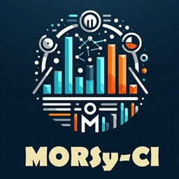

<p align="center">
  
</p>

<p align="center">
  
  <a href="https://www.gnu.org/licenses/gpl-3.0"></a>
</p>

**MORSy-CI** (*Multi-Objective Robust System for Constructing Composite Indicators*) is a cutting-edge scientific platform designed for building composite indicators. It is the first system to integrate multi-objective optimization with rigorous quality criteria, filling critical gaps of subjectivity and arbitrariness found in traditional methods.

By harmonizing conflicting objectives, MORSy-CI ensures technical robustness without sacrificing interpretability, offering a transparent framework for analyzing public policies and urban inequalities.

---

## 🧠 Methodological Innovation

Unlike software limited to isolated methods, MORSy-CI uses **non-local search** to simultaneously maximize four pillars of reliability:

1. **Explanatory power:** Maximizes the relationship with reference variables.
2. **Informational power:** Retains the maximum amount of information from the underlying variables.
3. **Discriminating power:** Ensures a clear differentiation between the analyzed units.
4. **Stability:** Minimizes uncertainty and ensures reliable measurements.

This approach overcomes common limitations, such as sensitivity to outliers and compensatory aggregation biases, resulting in indicators that exceed reference thresholds in scientific literature.

---

## 🌟 Key Features

- **Optimized Weighting:** An algorithm that eliminates arbitrary weight assignment through objective quality criteria.
- **Data Normalization and Processing:** Support for *Robust*, *Normal*, and *Ranking* methods, featuring automatic outlier removal to ensure analysis integrity.
- **Parallel Processing:** High-performance calculation engine for simultaneous processing of multiple indicators.
- **Comparative Benchmarking:** The system automatically generates results via classical validation methods:
    - **PCA:** Focused on retaining original information.
    - **BoD (Benefit of the Doubt):** Focused on avoiding political disputes over weights.
    - **Entropy:** Focused on easing the interpretation of results.
    - **Equal Weights:** Focused on simplicity of communication.
- **Decision Dashboards:** Advanced visualizations to reduce the decision-maker's cognitive stress:
    - Histograms and Scatter Plots.
    - Correlation heatmaps.
    - Parallel categories charts for sensitivity and uncertainty analysis.

---

## 📊 Case Study

The system was validated using data from the city of **São Sebastião do Paraíso (MG, Brazil)**, where it accurately revealed center-periphery patterns in the provision of public services (sanitation, paving, public lighting). 

**Result:** MORSy-CI outperformed traditional methods (PCA, BoD, Entropy) in at least three of the four evaluated dimensions, proving to be a practical and replicable tool for promoting territorial equity.

---

## 🚀 Roadmap and Future

MORSy-CI is a constantly evolving project. Our next steps include:
- **Flexible Thresholds:** Allowing custom strictness configurations for reliability measures.
- **Expert Opinion:** Integrating minimum and maximum weight constraints based on specialized knowledge.
- **New Aggregation Techniques:** Including different normalization and sub-indicator aggregation approaches.
- **Expanded Sensitivity Analysis:** Considering multiple linkage variables and new indicators for atypical measurements.

---

## 📄 Publication

This software is the result of detailed scientific research. If you use MORSy-CI in your work, please cite our original paper (link coming soon).

---

## 🔗 Live Demo

Access the production application here:  
👉 [MORSy-CI Live](https://robust-optimizer-1033542820153.southamerica-east1.run.app/)

---

## 🛠️ Tech Stack

- **Backend:** Python with Flask
- **Data Processing:** Pandas, NumPy
- **Visualization:** Plotly
- **Infrastructure:** Google Cloud Run, Firestore, Storage

---

## 🚀 Getting Started

### Prerequisites

- Python 3.9+
- Configured Google Cloud SDK.

### Local Installation

1. **Clone the repository:**
   ```bash
   git clone https://github.com/Heveraldo/morsy-ci.git
   cd morsy-ci
   ```

2. **Install the dependencies:**
   ```bash
   pip install -r requirements.txt
   ```

3. **Run the development server:**
   ```bash
   python main.py
   ```
---

## ☁️ Deploy no Google Cloud

To build and deploy to the managed infrastructure:

```bash
# Via Cloud Build
gcloud builds submit --tag gcr.io/robust-optimizer/index 
gcloud run deploy --image gcr.io/robust-optimizer/index --platform managed

# Or directly via source code
gcloud run deploy --source .
```

---

## 📂 Project Structure

- `main.py`: Main web application, route management, and user interface.
- `processardados.py`: Parallel processing engine and optimization logic.
- `static/`: Static resources (CSS, JS, images).
- `templates/`: Jinja2 templates for HTML rendering.

---

## 📄 License

Distributed under the GNU GPL v3.0 license. See the LICENSE file for more information.


### Previous Version

- robust-optimizer
Multi-Objective Robust Optimizer

- Cloud build & deploy
gcloud builds submit --tag gcr.io/robust-optimizer/index 
gcloud run deploy --image gcr.io/robust-optimizer/index --platform managed


- Or just
gcloud run deploy --source . --set-env-vars FLASK_SECRET_KEY="your_secret_key_here" CLOUD_STORAGE_BUCKET="your_bucket_name"

- To revert update
gcloud components update --version 508.0.0


#
# Em português-BR


<p align="center">
  
</p>

<p align="center">
  
  <a href="https://www.gnu.org/licenses/gpl-3.0"></a>
</p>

**MORsy-CI** (*Multi-Objective Robust System for Constructing Composite Indicators*) é uma plataforma científica de vanguarda projetada para a construção de indicadores compostos. É o primeiro sistema a integrar otimização multi-objetivo com critérios rigorosos de qualidade, preenchendo lacunas críticas de subjetividade e arbitrariedade presentes em métodos tradicionais.

Ao harmonizar objetivos conflitantes, o MORsy-CI garante robustez técnica sem sacrificar a interpretabilidade, oferecendo uma estrutura transparente para a análise de políticas públicas e desigualdades urbanas.

---

## 🧠 Inovação Metodológica

Diferente de softwares limitados a métodos isolados, o MORsy-CI utiliza **busca não-local (non-local search)** para maximizar simultaneamente quatro pilares de confiabilidade:

1.  **Poder Explicativo (Explanatory power):** Maximiza a relação com variáveis de referência.
2.  **Poder Informacional (Informational power):** Retém o máximo de informação das variáveis subjacentes.
3.  **Poder Discriminante (Discriminating power):** Garante a diferenciação clara entre as unidades analisadas.
4.  **Estabilidade:** Minimiza a incerteza e garante medições confiáveis.

Essa abordagem supera limitações comuns, como a sensibilidade a *outliers* e vieses de agregação compensatória, resultando em indicadores que excedem os limiares de referência da literatura científica.

---

## 🌟 Principais Recursos

- **Ponderação Otimizada:** Algoritmo que elimina a atribuição arbitrária de pesos através de critérios objetivos de qualidade.
- **Normalização e Tratamento de Dados:** Suporte a métodos *Robust*, *Normal* e *Ranking*, com remoção automática de outliers para garantir a integridade da análise.
- **Processamento Paralelo:** Motor de cálculo de alto desempenho para processamento simultâneo de múltiplos indicadores.
- **Benchmarking Comparativo:** O sistema gera automaticamente resultados via métodos clássicos para validação:
    - **PCA:** Foco em retenção de informação original.
    - **BoD (Benefit of the Doubt):** Foco em evitar disputas políticas de pesos.
    - **Entropy:** Foco em facilitar a interpretação dos resultados.
    - **Equal Weights:** Foco na simplicidade de comunicação.
- **Dashboards de Decisão:** Visualizações avançadas para reduzir o estresse cognitivo do tomador de decisão:
    - Histogramas e Gráficos de Dispersão.
    - Mapas de calor de correlação.
    - Gráficos de categorias paralelas para análise de sensibilidade e incerteza.

---

## 📊 Estudo de Caso

O sistema foi validado com dados da cidade de **São Sebastião do Paraíso (MG)**, onde revelou com precisão padrões centro-periferia na oferta de serviços públicos (saneamento, pavimentação, iluminação). 

**Resultado:** O MORsy-CI superou métodos tradicionais (PCA, BoD, Entropia) em pelo menos três das quatro dimensões avaliadas, provando ser uma ferramenta prática e replicável para promover a equidade territorial.

---

## 🚀 Roadmap e Futuro

O MORsy-CI é um projeto em constante evolução. Nossos próximos passos incluem:
- **Limiares Flexíveis:** Permitir a configuração personalizada de rigor para as medidas de confiabilidade.
- **Opinião de Especialistas:** Integrar restrições de pesos mínimos e máximos baseados em conhecimento especializado.
- **Novas Técnicas de Agregação:** Incluir diferentes abordagens de normalização e agregação de sub-indicadores.
- **Análise de Sensibilidade Expandida:** Considerar múltiplas variáveis de ligação e novos indicadores de medições atípicas.

---

## 📄 Publicação

Este software é o resultado de uma pesquisa científica detalhada. Se você utilizar o MORsy-CI em seu trabalho, por favor, cite nosso artigo original (link em breve).

---

## 🔗 Demo ao Vivo

Acesse a aplicação em produção aqui:  
👉 [MORsy-CI Live](https://robust-optimizer-1033542820153.southamerica-east1.run.app/)

---

## 🛠️ Stack Tecnológica

- **Backend:** Python com Flask
- **Processamento de Dados:** Pandas, NumPy
- **Visualização:** Plotly
- **Infraestrutura:** Google Cloud Run, Firestore, Storage

---

## 🚀 Começando

### Pré-requisitos

- Python 3.9+
- Google Cloud SDK configurado.

### Instalação Local

1. **Clone o repositório:**
   ```bash
   git clone https://github.com/seu-usuario/morsy-ci.git
   cd morsy-ci
   ```

2. **Instale as dependências:**
   ```bash
   pip install -r requirements.txt
   ```

3. **Execute o servidor de desenvolvimento:**
   ```bash
   python main.py
   ```

---

## ☁️ Deploy no Google Cloud

Para realizar o build e deploy na infraestrutura gerenciada:

```bash
# Via Cloud Build
gcloud builds submit --tag gcr.io/robust-optimizer/index 
gcloud run deploy --image gcr.io/robust-optimizer/index --platform managed

# Ou diretamente via código fonte
gcloud run deploy --source .
```

---

## 📂 Estrutura do Projeto

- `main.py`: Aplicação web principal, gestão de rotas e interface com o usuário.
- `processardados.py`: Motor de processamento paralelo e lógica de otimização.
- `static/`: Recursos estáticos (CSS, JS, imagens).
- `templates/`: Templates Jinja2 para renderização HTML.

---

## 📄 Licença

Distribuído sob a licença GNU GPL v3.0. Consulte o arquivo `LICENSE` para obter mais informações.


### Versão Anterior

- robust-optimizer
Otimizador Robusto Multi Objetivo

- Cloud buid & deploy
gcloud buids submit --tag gcr.io/robust-optimizer/index 
gcloud run deploy --image gcr.io/robust-optimizer/index --platform managed


- Ou apenas
gcloud run deploy --source . --set-env-vars FLASK_SECRET_KEY="sua_chave_secreta_aqui" CLOUD_STORAGE_BUCKET="nome_do_seu_bucket"


- To revert update
gcloud components update --version 508.0.0
